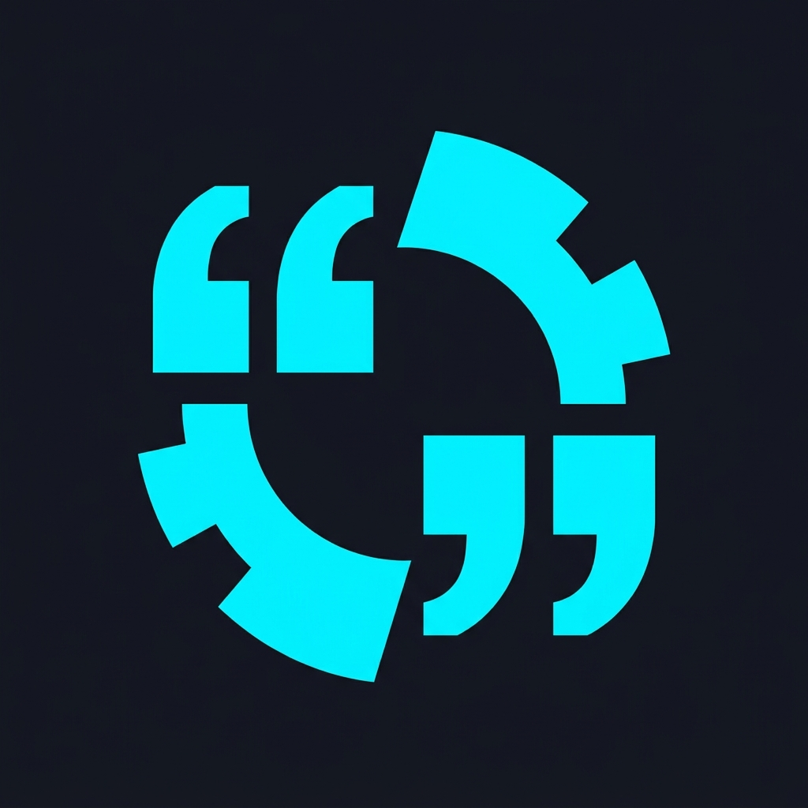
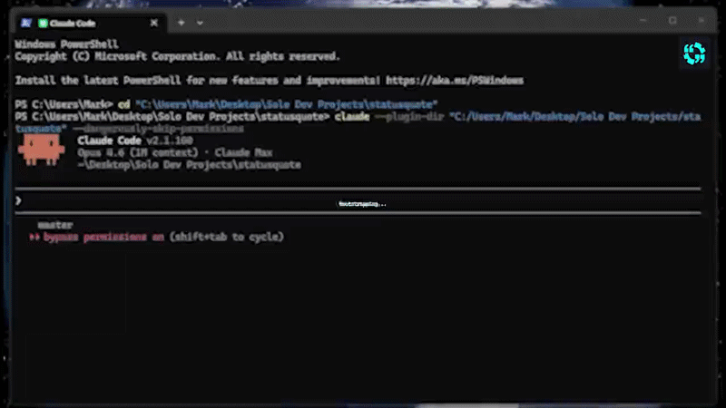
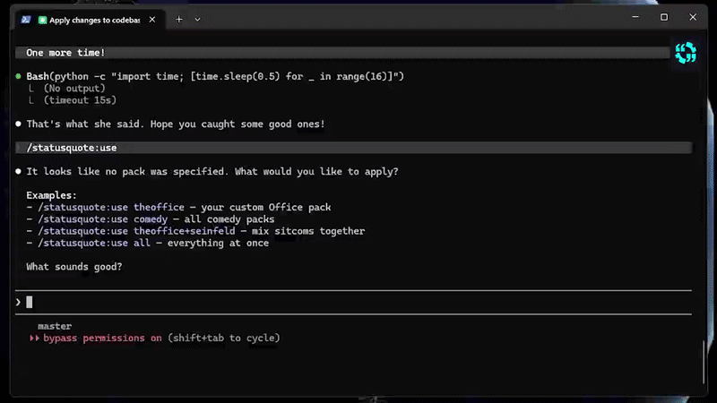

<p align="center">
  
</p>

<h1 align="center">Statusquote</h1>

<p align="center"><strong>Disrupt the status quo.</strong></p>

<p align="center">A Claude Code plugin that replaces the default spinner words with quotes from your favorite movies, TV shows, and characters — or generate your own for any franchise, instantly.</p>

> *Why settle for "Bamboozling" when Claude could be "Engaging", "Force choking", or telling you "There is no spoon"?*

## Install

```bash
/plugin marketplace add FurbySoup/status-quote
/plugin install statusquote@statusquote
```

Or load directly:
```bash
claude --plugin-dir /path/to/statusquote
```

## See It In Action

### Browse packs and create your own



*Browse the 16 built-in franchise and character packs, then generate a brand new pack for The Office US — complete with preview, editing, and instant activation.*

### Mix your favorite franchises



*The ultimate nerd spinner — blend LOTR, Star Trek, and Star Wars into one pack. Claude cycles through "Forging", "Make it so", and "Use the Force" while it works.*

## Quick Start

```
/statusquote:use startrek              # Apply a built-in pack
/statusquote:use yoda+vader            # Mix characters
/statusquote:use fantasy               # Apply an entire genre
/statusquote:create the office         # Generate any pack on the fly
/statusquote:list                      # See everything available
/statusquote:reset                     # Back to defaults
```

## Create Any Pack, Instantly

Statusquote ships with 16 curated packs, but you're not limited to them. Generate a pack for **any** movie, TV show, or character — Claude builds it, validates it, and makes it available immediately:

```
/statusquote:create breaking bad       # TV shows
/statusquote:create fight club         # Movies
/statusquote:create michael scott      # Specific characters
/statusquote:create doctor who         # Sci-fi classics
/statusquote:create pokemon            # Anime
/statusquote:create the sopranos       # Drama
```

Custom packs are saved to `~/.statusquote/packs/`, persist across sessions, and work with all commands — mix them with built-in packs, include them in groups, or use `/statusquote:use custom` to apply all your creations at once.

## Built-in Packs

### Franchise Packs (10)

| Key | Franchise | Entries | Alias | Sample |
|-----|-----------|---------|-------|--------|
| `startrek` | Star Trek | 35 | | Engaging, Make it so |
| `starwars` | Star Wars | 35 | | Channeling the Force, Do or do not |
| `lotr` | Lord of the Rings | 35 | | Forging, You shall not pass |
| `matrix` | The Matrix | 35 | | Jacking in, There is no spoon |
| `sherlock` | Sherlock Holmes | 35 | | Deducing, Elementary |
| `marvel` | Marvel MCU | 35 | | Assembling, I am Iron Man |
| `harrypotter` | Harry Potter | 35 | `hp` | Casting spells, Expecto Patronum |
| `princessbride` | The Princess Bride | 35 | `bride` | Storming the castle, Inconceivable |
| `jurassicpark` | Jurassic Park | 35 | `jp` | Sequencing DNA, Life finds a way |
| `backtothefuture` | Back to the Future | 35 | `bttf` | Flux capacitating, Great Scott |

### Character Packs (6)

| Key | Character | Entries | Alias | Sample |
|-----|-----------|---------|-------|--------|
| `yoda` | Yoda | 30 | | Contemplating I am, Do or do not |
| `vader` | Darth Vader | 30 | | Force choking, I find your lack of faith disturbing |
| `gandalf` | Gandalf | 30 | | Wizarding, You shall not pass |
| `sparrow` | Jack Sparrow | 30 | `jack` | Swashbuckling, But you have heard of me |
| `t800` | The Terminator | 30 | `terminator` | Scanning, I'll be back |
| `groot` | Groot | 20 | | I am Grooting, I am Groot! |

**520 entries across 16 built-in packs + unlimited custom packs.**

## Groups and Mixing

Apply multiple packs at once with group keywords or `+` combinations:

| Group | Entries |
|-------|---------|
| `all` | Everything (built-in + custom) |
| `franchises` | All 10 franchise packs |
| `characters` | All 6 character packs |
| `custom` | All your generated packs |
| `scifi` | Trek, Wars, Matrix, JP, BTTF, Marvel, T-800, Vader, Yoda, Groot |
| `fantasy` | LOTR, HP, Bride, Wars, Gandalf, Yoda |
| `comedy` | BTTF, Bride, Sparrow, Groot |
| `action` | Marvel, T-800 |
| `mystery` | Sherlock |

```
/statusquote:use fantasy+t800          # Genre + character
/statusquote:use characters+startrek   # Group + franchise
/statusquote:use custom+scifi          # Your packs + a genre
```

## Style Modes

Control what type of entries appear in the spinner:

```
/statusquote:style verbs               # Gerund-style only ("Engaging", "Scanning")
/statusquote:style phrases             # Short quotes only ("Make it so", "Inconceivable")
/statusquote:style mix                 # Both combined (default)
```

## How It Works

Statusquote writes to the `spinnerVerbs` setting in `~/.claude/settings.json`:

```json
{
  "spinnerVerbs": {
    "mode": "replace",
    "verbs": ["Engaging", "Scanning", "Make it so", "Fascinating"]
  }
}
```

A backup of your settings is saved before every change to `~/.claude/backups/`.

## Requirements

- Claude Code with plugin support
- Python 3.10+
- Bash (Git Bash on Windows)

## License

MIT
